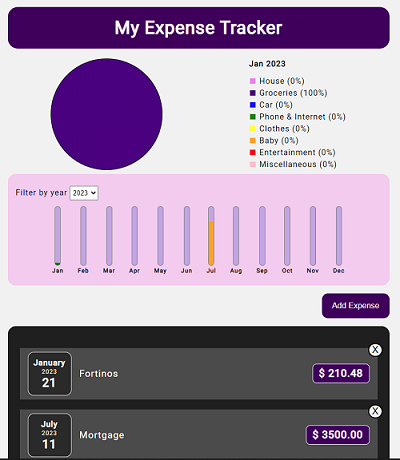

# My Expense Tracker

## An expense tracking web app developed with React

>**Note:** This is a work-in-progress and not the finished product.

### Purpose
My Expense Tracker is a user-friendly expense tracking web app that helps users monitor their expenses efficiently. It offers useful features like annual summaries and monthly charts for a comprehensive financial analysis in one place.

The web app can be visted at [https://myexpensetracker.ca/](https://myexpensetracker.ca/)

### Features
* Monthly pie charts
* Filter expenses by year
* Add new expenses
* Remove expenses
* The bar for each month is color-coded to indicate spending level relative to fixed monthly allowance of $5,000. The color scale ranges from green for spending below 50% of allowance, to yellow for spending between 50% and 75%, and finally to red for spending exceeding 75% of allowance

### What am I working on right now?
I am currently following a Udemy course to learn how to use React routers and implement them in my app, specifically for creating a login/signup page. Once users successfully log in, they will be directed to their individual app homepage.